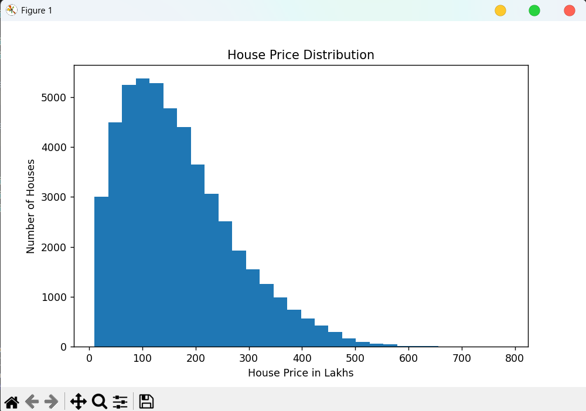
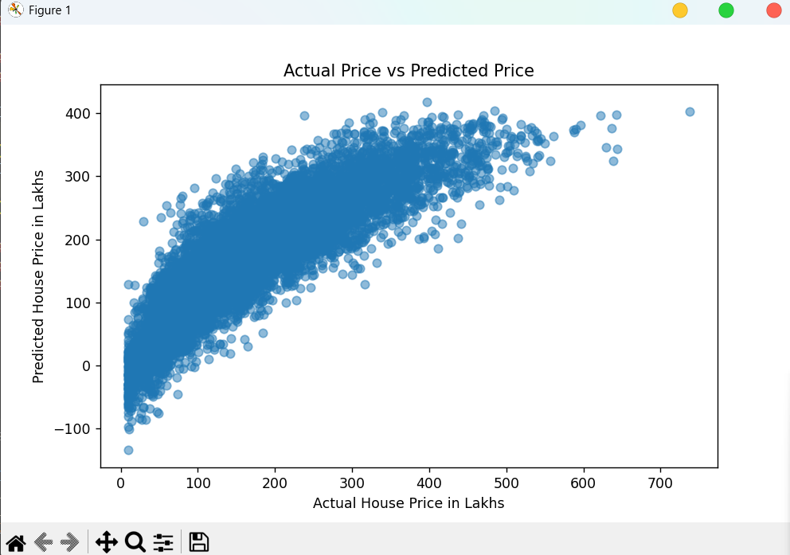

# 🏠 House Price Prediction Using Linear Regression

A Machine Learning project that predicts house prices based on various property features using a Linear Regression model.

The project includes data loading, data cleaning, exploratory data analysis, feature selection, model training, model evaluation, coefficient interpretation, model saving, and example house price predictions.

---

## 📌 Project Overview

House price prediction is a common Machine Learning regression problem. The objective of this project is to build a model that can estimate house prices based on different property characteristics.

The model is trained using a housing dataset containing information such as the number of bedrooms, bathrooms, property area, parking spaces, amenities, maintenance fees, and distance from important locations.

Linear Regression is used as the Machine Learning algorithm for predicting house prices.

---

## 🎯 Objectives

* Load and explore the housing dataset
* Check and clean missing and duplicate values
* Perform Exploratory Data Analysis (EDA)
* Analyze feature correlation with house prices
* Select important numerical features
* Split the dataset into training and testing data
* Train a Linear Regression model
* Predict house prices
* Evaluate the model using RMSE and R² Score
* Interpret model coefficients
* Visualize actual and predicted house prices
* Save the trained Machine Learning model
* Perform example house price predictions

---

## 📊 Dataset

The project uses the `housing_price_dataset.csv` dataset.

The target variable used for prediction is:

`price_in_lakhs`

The dataset contains property-related information including:

* BHK
* Bathrooms
* Balconies
* Built-up Area
* Carpet Area
* Property Age
* Parking Spaces
* Security Score
* Gym Availability
* Swimming Pool Availability
* Power Backup
* Lift Availability
* Monthly Maintenance Fee
* Distance to City Center
* Distance to Metro
* Nearby Schools
* Nearby Hospitals

The `property_id` column is not used for model training because it is a unique identifier.

The `price_category` column is also excluded to avoid possible data leakage because it is related to the target house price.

---

## 🛠️ Technologies Used

* Python
* Pandas
* NumPy
* Matplotlib
* Scikit-learn
* Joblib

---

## 🔄 Machine Learning Workflow

The project follows the following Machine Learning workflow:

`Dataset → Data Cleaning → Exploratory Data Analysis → Feature Selection → Train-Test Split → Model Training → Prediction → Model Evaluation → Coefficient Interpretation → Model Saving`

---

## 🧹 Data Cleaning

The dataset is checked for:

* Missing values
* Duplicate records

Duplicate rows and missing values are removed before training the Machine Learning model.

---

## 📈 Exploratory Data Analysis

Exploratory Data Analysis is performed to understand the distribution and relationship of housing features.

A house price distribution graph is generated to analyze the variation in property prices.

### House Price Distribution



The graph shows the distribution of house prices in the dataset. Most properties are concentrated in the lower and medium price ranges, while fewer properties are available in the higher price range.

---

## 🔍 Feature Correlation

Correlation analysis is performed to understand the relationship between numerical features and house prices.

Important features showing a strong relationship with house prices include:

* Built-up Area
* Carpet Area
* BHK
* Monthly Maintenance Fee
* Bathrooms
* Swimming Pool Availability
* Security Score
* Gym Availability

Distance from the city center shows a negative relationship with house prices.

This indicates that properties located farther from the city center may generally have lower prices.

---

## 🤖 Machine Learning Model

The Machine Learning algorithm used in this project is:

### Linear Regression

Linear Regression attempts to find a linear relationship between property features and house prices.

The model is trained using the training dataset and evaluated using unseen testing data.

---

## ✂️ Train-Test Split

The dataset is divided into:

* 80% Training Data
* 20% Testing Data

A `random_state` value of `42` is used to maintain reproducible results.

---

## 📏 Model Evaluation

The model is evaluated using the following regression metrics:

### RMSE - Root Mean Squared Error

RMSE measures the average prediction error of the model.

A lower RMSE value indicates better prediction performance.

### R² Score

R² Score measures how much variation in house prices is explained by the Machine Learning model.

An R² Score closer to `1` indicates better model performance.

---

## 📉 Actual Price vs Predicted Price



The scatter plot compares actual house prices with the prices predicted by the Linear Regression model.

A positive relationship between actual and predicted prices can be observed. The model captures the general pattern of house prices, although some prediction errors are present.

---

## 🧠 Coefficient Interpretation

Linear Regression coefficients are analyzed to understand the effect of each property feature on predicted house prices.

A positive coefficient indicates that an increase in the feature may increase the predicted house price while keeping other model features constant.

A negative coefficient indicates that an increase in the feature may decrease the predicted house price while keeping other model features constant.

This helps understand how different property characteristics influence the model's predictions.

---

## 💾 Model Saving

The trained Linear Regression model is saved using Joblib.

The saved model file is:

`house_price_model.pkl`

The saved model can be loaded later without retraining the model.

---

## 🏡 Example Prediction

The project includes an example property with features such as:

* 3 BHK
* 2 Bathrooms
* 2 Balconies
* 1500 sq. ft. Built-up Area
* 1200 sq. ft. Carpet Area
* Parking Space
* Gym
* Swimming Pool
* Power Backup
* Lift Availability

The trained model uses these property features to generate an estimated house price in lakhs.

---

## 📂 Project Structure

```text
House-Price-Prediction/
│
├── house_price_prediction.py
├── housing_price_dataset.csv
├── house_price_model.pkl
├── house_price_distribution.png
├── actual_vs_predicted_price.png
├── requirements.txt
├── README.md
└── .gitignore
```

---

## ⚙️ Installation

Clone the repository:

```bash
git clone <your-repository-url>
```

Navigate to the project directory:

```bash
cd House-Price-Prediction
```

Install the required Python libraries:

```bash
pip install -r requirements.txt
```

---

## ▶️ Run the Project

Run the Python file using:

```bash
python house_price_prediction.py
```

The program will:

1. Load the housing dataset
2. Explore and clean the data
3. Analyze feature correlations
4. Train the Linear Regression model
5. Generate house price predictions
6. Calculate RMSE and R² Score
7. Display model coefficients
8. Generate visualization graphs
9. Save the trained model
10. Predict the price of an example house

---

## 📦 Requirements

The project requires the following Python libraries:

```text
pandas
numpy
matplotlib
scikit-learn
joblib
```

Install all dependencies using:

```bash
pip install -r requirements.txt
```

---

## 🚀 Future Improvements

The project can be improved by:

* Adding categorical features using One-Hot Encoding
* Creating a complete Scikit-learn preprocessing pipeline
* Comparing multiple regression algorithms
* Using Random Forest Regression
* Using Gradient Boosting models
* Performing Cross Validation
* Performing Hyperparameter Tuning
* Detecting and handling outliers
* Building a prediction API using FastAPI
* Creating a web-based user interface
* Deploying the Machine Learning model

---

## 📝 Conclusion

In this project, a House Price Prediction model was developed using the Linear Regression algorithm. The housing dataset was loaded, cleaned, explored, and analyzed before model training.

Important property features were selected and used to train the model. The model's performance was evaluated using RMSE and R² Score. Linear Regression coefficients were also analyzed to understand the effect of different property features on predicted house prices.

The trained model was successfully saved and used to generate example house price predictions.

Overall, this project demonstrates the complete basic Machine Learning workflow for solving a regression problem and predicting house prices using property-related features.

---

## 👨‍💻 Author

**Gourav Chaturvedi**

Machine Learning and Full Stack Development Enthusiast
